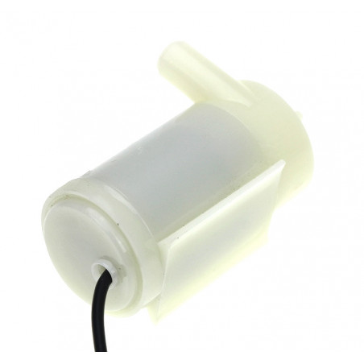

# Water pump horizontal configuration

## Module Description 
This module is a dc water pump with a horizontal configuration. This means the device is designed to lay on its side.\
The pump needs to be submersed in the source of water at all times.\

**Supply Voltage:** 3-5 vdc\
**Max Flow:** 80L/hour\
**Max Pressure:** 350mm/h20

**Dimensions:** 46mm(L) X 31mm(W)

### Device from the side

## Device Count
There is the following number of devices in the inventory: <Number of devices in storage>