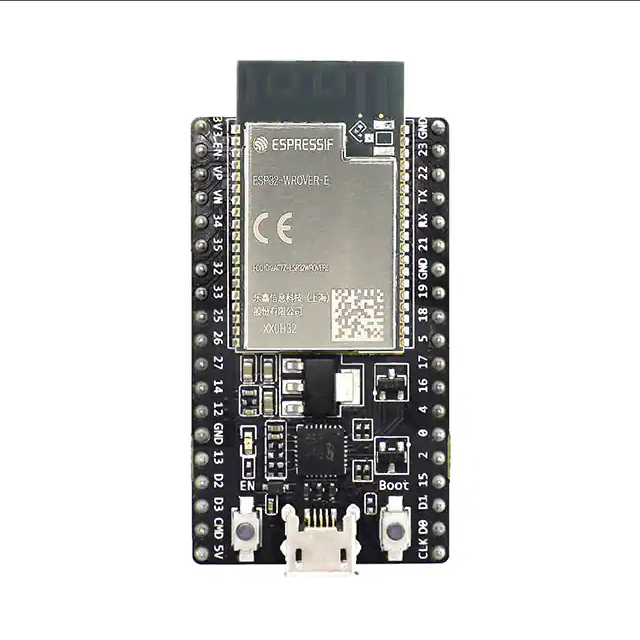

# ESP32 DevKitC 32VE

## Module Description 
ESP32-WROVER-E devkit. This allows you to use an esp32 without having to use an usb-serial converter as it is built in.

To interface with the esp32 use a micro-usb cable.

The ESP32 model that is mounted on this board is a ESP32-WROVER-E. This refers to the specific chip.\
The board is called ESP32 DevKitC 32VE.

### Specsheet
[ESP32-WROVER-E datasheet](../specsheets/esp32-wrover-e_esp32-wrover-ie_datasheet_en.pdf)

### Device top down view

### Device pin breakout graphic

## Device Count
There are the following number of devices in the inventory: <Number of devices in storage>