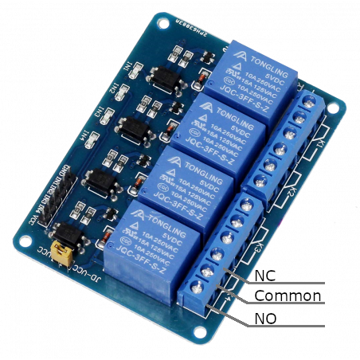

# Relay Module with 4 relays

## Module Description

This module is a set of 4 mechanical relays. There are four independent relay channels that share a common supply and ground.\
To use the relay you need to supply a 5vdc signal on the relevant control pin.\
The module has 4 leds that indicate the signal state of the relays.\
The output of each relay has a normally opened (NO), a normally closed(NV) and a common(COM).\
When a relay is powered the NO contact closes the NC contact opens.\
The signal on both NC and NO comes from the COM terminal of the relay.\

The inputs for the relays are galvanically isolated from the relay to ensure that switching the relay does not damage the mainboard.\

Inputs on pin header (left side on image)
- GND: Ground.
- IN1: Signal pin for the first relay.
- IN2: Signal pin for the second relay.
- IN3: Signal pin for the third relay.
- IN4: Signal pin for the forth relay.
- VCC: 5v supply input.

Outputs on screw terminal (right side on image).\
Relay 1
- NO : Will be disconnected while the relay is unpowered.
- NC : Will be connected while the relay is unpowered.
- COM: Common

## Specsheet for the individual relays
[Relay - JQC-3FF-v1](../specsheets/jqc-3ff-v1.pdf)

### Device Overview

## Device Count
There are the following number of devices in the inventory: 4