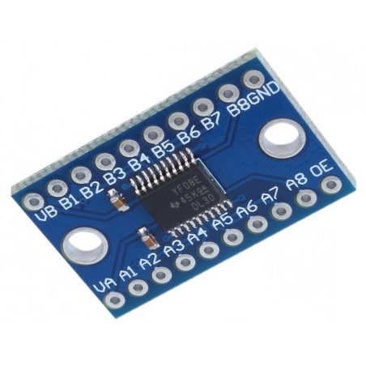

# 8 Channel signal level converter

## Module Description
This device will convert logic signals from a voltage range of 1.2-3.6v to a range of 1.65-5.5v.\
The device has 8 channels that will independently convert the signal.\
The output of the A ports are supplied with the voltage from VA and the output of the B ports are supplied with the voltage from VB.\
The relationship between the voltage sources should always be VA ≤ VB.\
To enable the output you need to give signal high on the Output Enable pin(OE). The voltage range for Signal high on OE is VA*0.65-5.5v

The output of the device will follow the input signal and it will be equal to the supply voltage for that side (VA or VB)

It is important that the ground is shared between the two sides of the device.

### Pinout
- VA: Supply voltage for output on A ports.
- VB: Supply voltage for output on B ports.
- OE: Output enable pin.
- A1-A8: Input/Output pins for low voltage(1.2-3.6v) ports.
- B1-B8: Input/Output pins for high voltage(1.65-5.5v) ports.
- GND: Shared Ground.

### Specsheet for the chip
[Level shifting chip](../specsheets/txs0108e-etc-ti.pdf)

### Signal level converter

## Device Count
There are the following number of devices in the inventory: 10