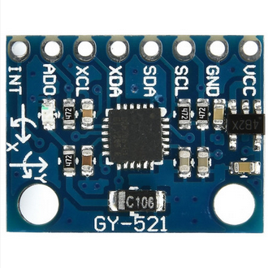
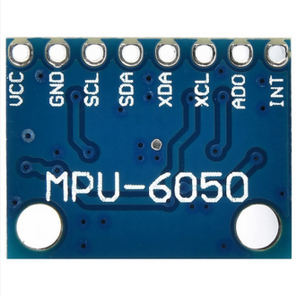

# Inertial Measurement Unit (IMU) aka Accelerometer and Gyroscope

## Module Description
This module is a combined accelerometer and gyroscope.\
It can be used to measure the acceleration and rotation of the device.\
The device has 3 axes of acceleration sensors and 3 axes of rotation detection.\
The sensor communicates via I2C.

**Input voltage:** 3-5 V

### Gyroscope
X, Y and Z angular rate sensors. These are programable to fullscale ranges of ±250, ±500, ±1000, and ±2000°/sec
16-bit ADCs for each axis for multiple axis measurements at the same time.\
Programmable low pass filter to reduce noise.\
**Operating current:** 3.6mA\
**Standby current:** 5μA

### Accelerometer
X, Y and Z acceleration sensors. These are programable to fullscale ranges of ±2, ±4, ±8, and ±16g.\
16-bit ADCs for each axis for multiple axis measurements at the same time.\
Tap detection.\
High-G Interrupt.\
Orientation detection.\
**Normal operating current:** 0.5mA

### Pinout
 - VCC: 3-5 V power input
 - GND: Ground
 - SCL: I2C clock
 - SDA: I2C data
 - XDA: Auxiliary data for chaining devices
 - XCL: Auxiliary clock for chaining devices
 - AD0: Address select pin (LOW: address 0x68, HIGH: address 0x69)
 - INT: Interrupt output pin (For activating interrupts on the microcontroller)

### Specsheet
[MPU-6050(chip)](../specsheets/mpu-6000-datasheet.pdf)

### Device from the top

### Device from the Bottom

### Device orientation from chip perspective

## Device Count
There is the following number of devices in the inventory: <Number of devices in storage>

## Purchase link
https://jentronic.dk/diverse-moduler/64-accelerometer-3-aksler.html