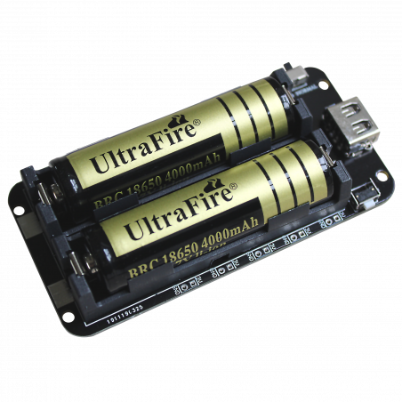

# Battery module 2pcs 18650 battery

## Module Description 

This module is a battery module with 2pcs 18650 battery. It can be used to power other devices.\
The module has three ways of delivering power. The divice has 3.3V outputs, 5V outputs and a single USB output.\
The module is able to chage the batteries through the usb ports on the bottom (usb-c and micro-b).\
There is a powerbutton on the side of the device. On the other side of the device there is a switch to select the operating mode.

Modes:
- HOLD: Hold mode will produce continous power.
- NORMAL: Normal mode will turn off the power output if the current draw is below 30 mA for more than 10 seconds.

Output 3.3v: 1A\
Output 5v: 2A\
Charging current: 800mA

### Device Overview

### Device Front

### Device Back

## Device Count
There are the following number of devices in the inventory: 9