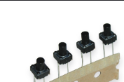

# Tacktile Button CR1102H

## Module Description 
Tacktile button

Max 50mA 50V

### Specsheet
[SpecSheet](../specsheets/button-tacktile-cr1102h.pdf)

### Device
" title="Buttons" style="max-width: 400px">

## Device Count
There are the following number of devices in the inventory: 

## Device Link
https://www.digikey.dk/da/products/detail/cit-relay-and-switch/CR1102H4-3F160/12502779
