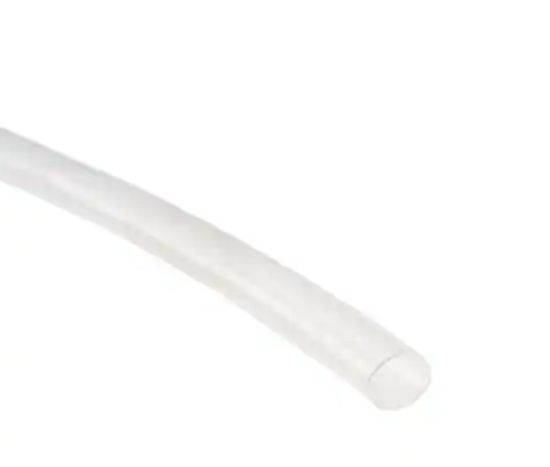

# Clear heat-shink 2.22mm

## Module Description 
Clear heatshink tubing with a internal diameter of 2.22 mm, and a shrunken diameter of 1.19mm

### Specsheet
[Description](../specsheets/ENG_DS_RW-175_905.pdf)

### Device

## Device Count
There are the following number of devices in the inventory: 1.22 Meter

## Device Link
https://www.digikey.dk/da/products/detail/te-connectivity-raychem-cable-protection/RW-175-3-32-X-STK/5440879?s=N4IgTCBcDaIEoHUC0BGA7AViQZgPTbCQA0kBlAFQGkkA5AERAF0BfIA
