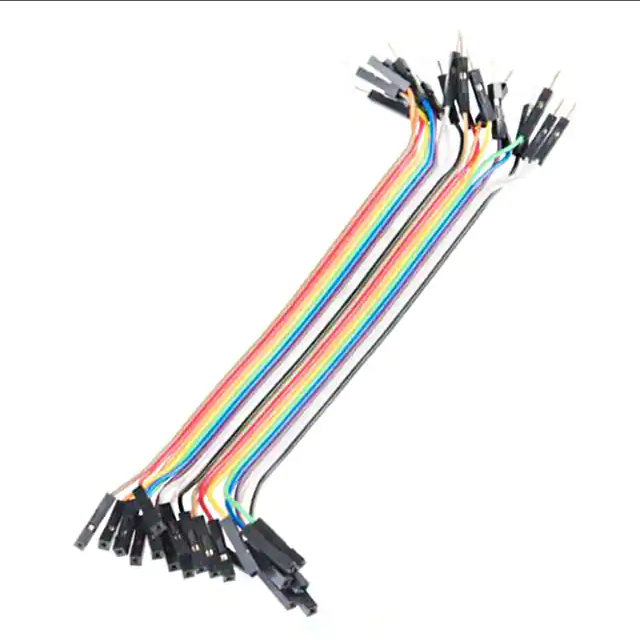

# Set of male to female dupont jumper wires

## Module Description 
A set of 30 male to female 6" 28AWG jumper cables

### Specsheet
[Description](../specsheets/male-female-jumper-set.pdf)

### Device

## Device Count
There are the following number of devices in the inventory: <Number of devices in storage>

## Device Link

https://www.digikey.dk/da/products/detail/sparkfun-electronics/PRT-12794/5993859