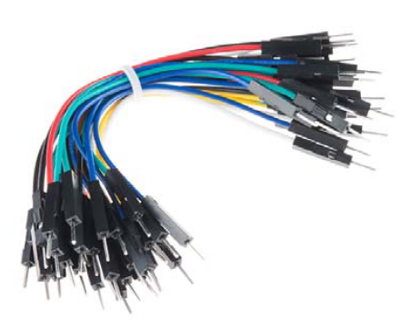

# Set of male to male dupont jumper wires

## Module Description 
A set of 30 male to male 4" 26AWG jumper cables

### Specsheet
[cables](../specsheets/male-male-jumper-pack-14284.pdf)

### Device

## Device Count
There are the following number of devices in the inventory: 150

## Device Link

https://www.digikey.dk/da/products/detail/sparkfun-electronics/PRT-14284/7324438