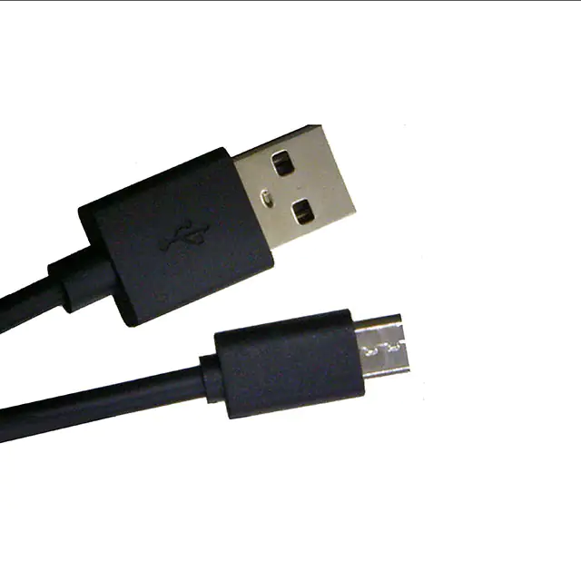

# Micro b usb cable 2m

## Module Description 
A 2 meter long usb micro b cable with a usb a connector on the other end.

### Specsheet
[Description](../specsheets/usb-cable-2m.pdf)

### Device

## Device Count
There are the following number of devices in the inventory: 200

## Device Link

https://www.digikey.dk/da/products/detail/cvilux-usa/DH-20M50056/13177301
