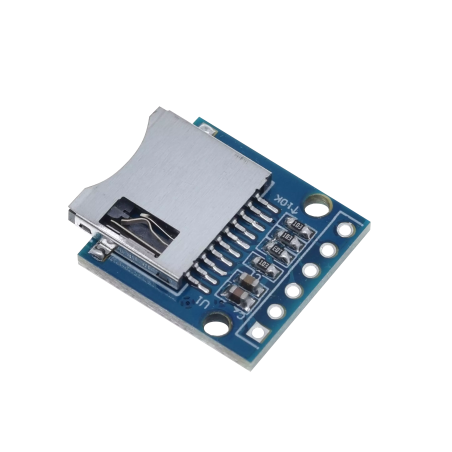
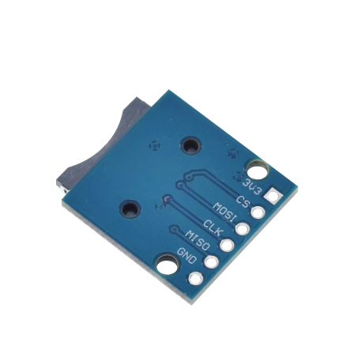

# Micro SD card reader SPI

## Module Description 

This module is a micro SD card reader. It can be used to read and write data to a micro SD card.\
The module uses an SPI interface to facilitate communication.\

Pinpout:
- 3V3: 3.3 Volt power in.
- CS: Chip select.
- MOSI: Master out, slave in.
- MISO: Master in, slave out.
- GND: Ground.

### Device Front

### Device Back

## Device Count
There are the following number of devices in the inventory: 8