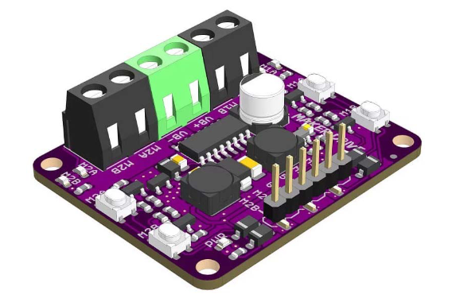
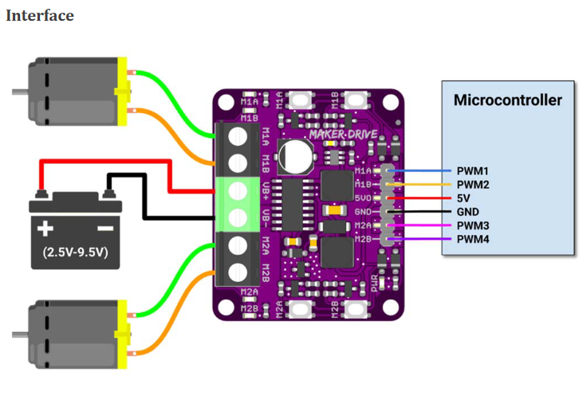

# MIX1508 H-Bridge Motor Driver

## Module Description 
H-Bridge motor driver

Motor voltage range: 2.5v - 9.5v
Max Current (Continuous): 1A
Max Current (Peak): 1.5A

5V _**output**_ to power controller

Signal inputs are compatible with 1.8V, 3.3V and 5V logic levels

### Control
Clockwise: \
    PWM1 = pwm signal to control speed \
    PWM2 = 0 \
Counterclockwise: \
    PWM1 = 0 \
    PWM2 = pwm signal to control speed

The same is the case with the outputs for the second motor (PWM3, PWM4).

### Specsheets
[Motor driver information document](../specsheets/mix1508-h-bridge-motor-driver.pdf)

### Device
" title="Motor driver" style="max-width: 400px">

" title="Pinout" style="max-width: 400px">

## Device Count
There are the following number of devices in the inventory: 50

## Device Link
https://www.digikey.com/en/products/detail/seeed-technology-co-ltd/105090003/10667536