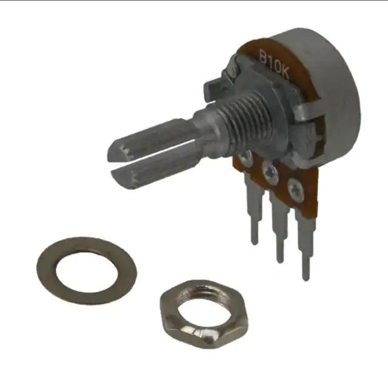

# 10k 1/5 Watt Potentiometer

## Module Description 
Potentiometer.

### Specsheet
[Description](../specsheets/potentiometer-10k.pdf)

### Device

## Device Count
There are the following number of devices in the inventory: 230

## Device Link

https://www.digikey.dk/da/products/detail/tt-electronics-bi/P160KN2-4QC20B10K/2408887
