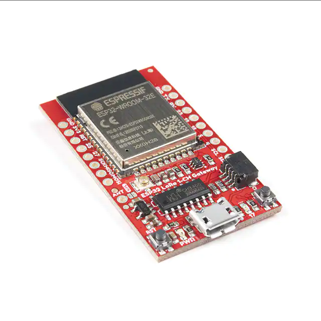

# SparkFun LoRa Gateway - 1-Channel (ESP32)

## Module Description 
This is an ESP32 DevBoard with a LoRa module.
It has an ESP32-WROOM-32 module and an RFM95W LoRa modem.

### Specsheet
[Board Datasheet](../specsheets/lora_gateway_1-channel_hookup_guide_web.pdf)
[Lorawan modem Datasheet](../specsheets/rfm95w-v2.0.pdf)

### Device

## Device Count
There are the following number of devices in the inventory: <Number of devices in storage>