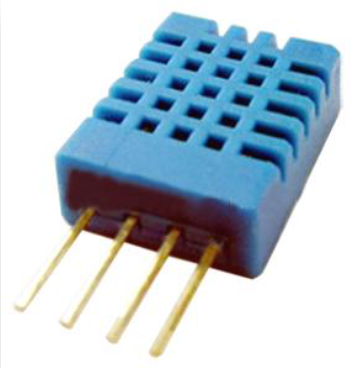

# Temperature/Humidity Sensor DHT11

## Module Description 

### Specsheet
[Specsheet](../specsheets/temperature-humidity-sensor-dht11.pdf)

### Device

## Device Count
There are the following number of devices in the inventory: 40

## Device Link
https://www.digikey.dk/da/products/detail/adafruit-industries-llc/386/5356713?s=N4IgTCBcDaIIwFYwA4C0cwtQOQCIgF0BfIA

